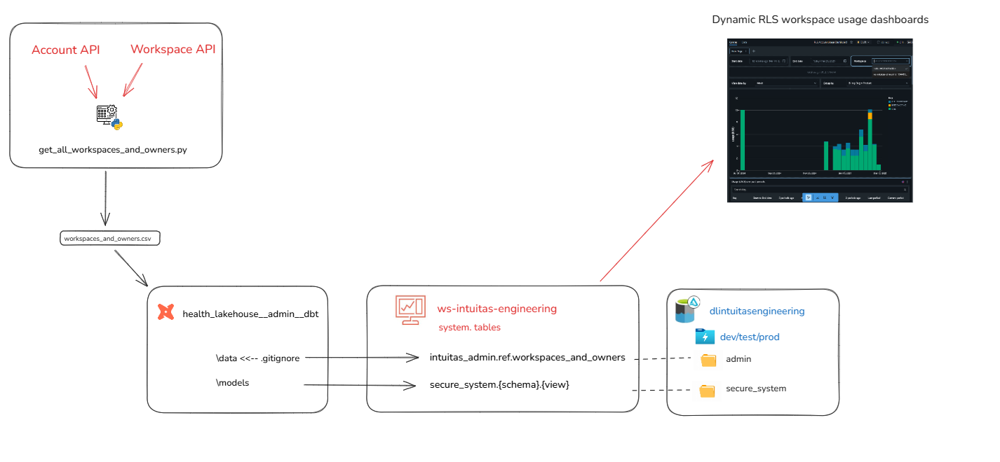

# **Get Databricks Workspace Owners**
return to [README](../README.md).

This tool fetches all Databricks workspaces and their administrators, outputting the data to CSV.
This CSV can then be used as a mapping table to drive dynamic system views; joined by workspace.


##



## Files

- `get_all_workspaces_and_owners.py`: This script fetches all Databricks workspaces and their administrators using Databricks and Azure APIs, and outputs the data to a CSV file.
- `.env`: Contains the Account ID - *ensure this is not checked into git*
- `.env_template`: A template for the environment variables required by the script, specifically the Databricks account ID.


## Prerequisites

1. Azure CLI installed and configured
2. Python 3.x
3. Required Python packages (see `requirements.txt`)

## Setup

1. Create a virtual environment

   ```bash
   python3 -m venv .venv
   source .venv/bin/activate
   pip install -r requirements.txt
   ```

2. Create a `.env` file in the root directory with your Databricks account ID. :
   ```
   ACCOUNT_ID=your-databricks-account-id
   ```
3. Add the `.env` file to `.gitignore`


## Usage

1. Authenticate with Azure:
   ```bash
   az login
   ```

2. Run the script:
   ```bash
   python3 get_all_workspaces_and_owners.py
   ```

3. Output will be saved to `output/workspace_owners.csv`

## Data Schema

The CSV output contains the following columns:
- `workspace_id`
- `workspace_name`
- `workspace_url`
- `admin_email`


