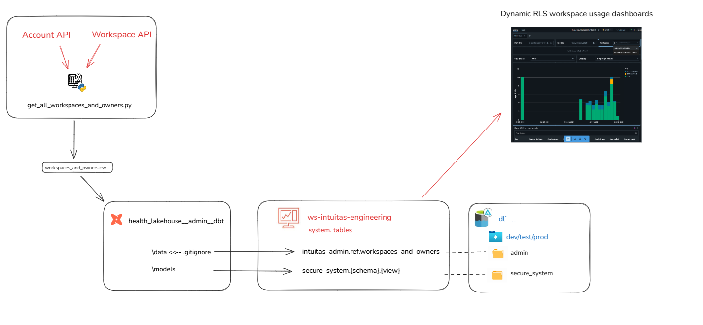

# **Secure System views**
return to [README](../README.md).

This folder contains key objects used within a dbt project designed to create dynamic views

##

## Files and folders
- `models`: dbt models to generate dynamic views
- `seeds`: place the `workspace_owners.csv` output of [get_all_workspaces_and_owners](get_all_workspaces_and_owners/get_all_workspaces_and_owners.md) here. 
    - **Ensure the seeds are added to .gitignore of your dbt project to avoid checking them in.** 
    - Note: an alternate approach to using a dbt seed is to upload `workspace_owners.csv` to a secure location create an external table over the csv file.
- `dbt_project.yml` - contains examples of how to configure environment-aware catalogs (databases) and schemas. Here the seed files are stored in a separate catalog to the secure_view catalog for added isolation.

