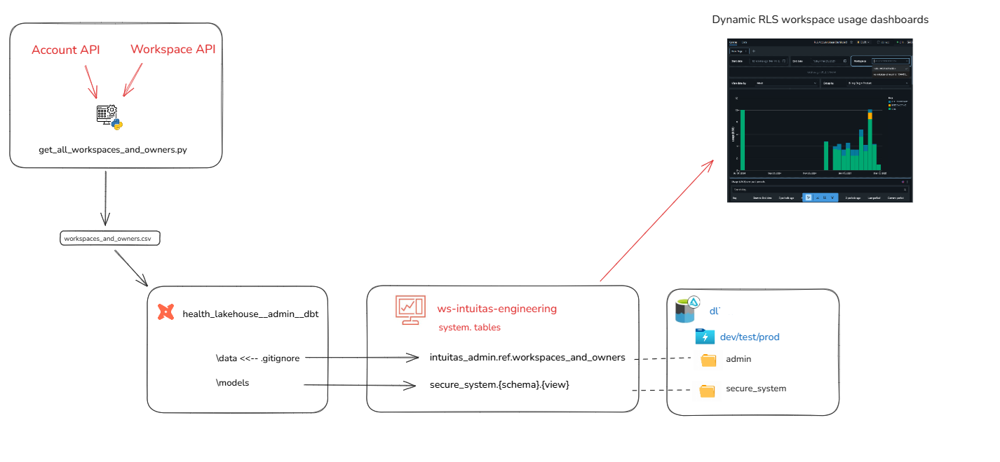

# **Usage Dashboard**
return to [README](../README.md).

This folder contains a RLS-applied Dashboard based on the Databricks provided dashboard [here](https://learn.microsoft.com/en-us/azure/databricks/admin/account-settings/usage) adapted to work with the `secure_system` catalog of dynamic views.

##

## Instructions to Import the Dashboard into Databricks through the UI

1. Open your Databricks workspace.
2. Click on  "Dashboards" 
4. Click on the "Import" button located at the top right corner of the workspace.
5. In the "Import" dialog, select the "File" option.
6. Click on "Drop files to upload" or "Choose File" to browse and select the `RLS Account Usage Dashboard.lvdash.json` file from your local machine.
7. After the import is complete, you will see the dashboard listed in your workspace.

You have successfully imported the Usage Dashboard into Databricks.